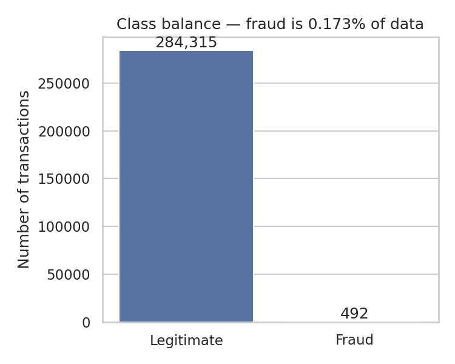
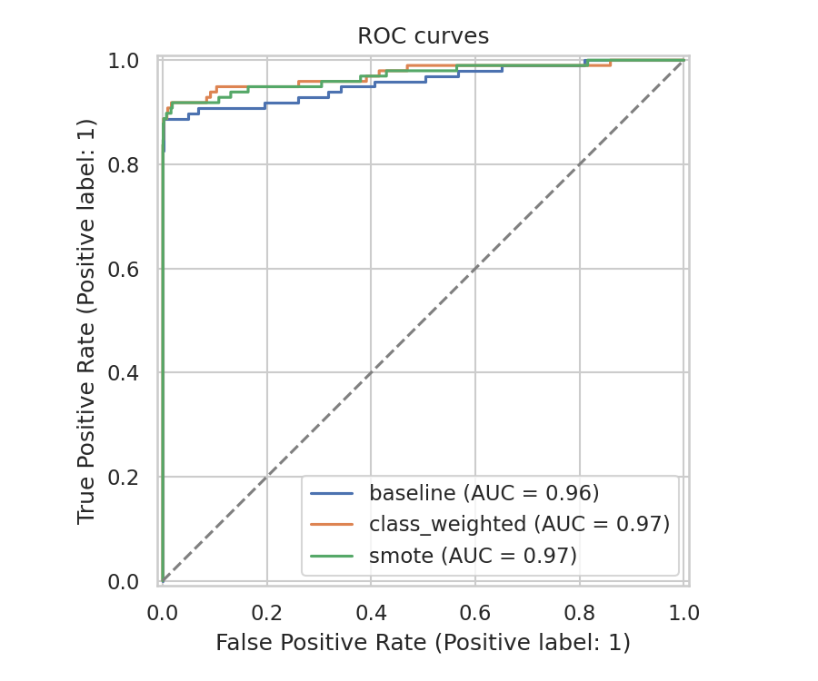
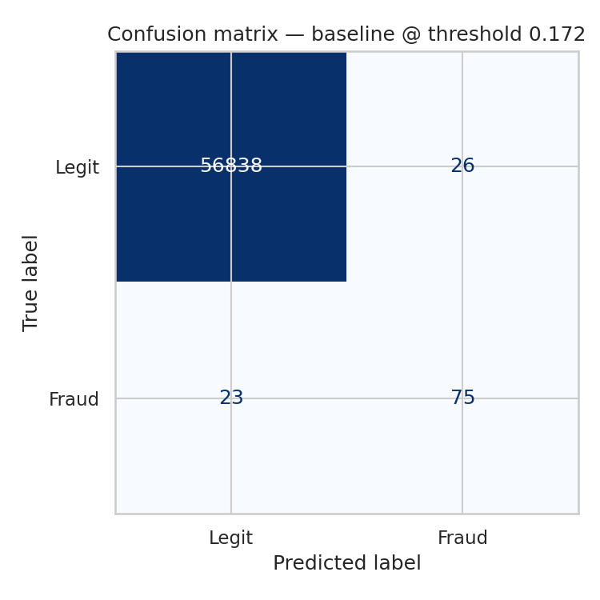
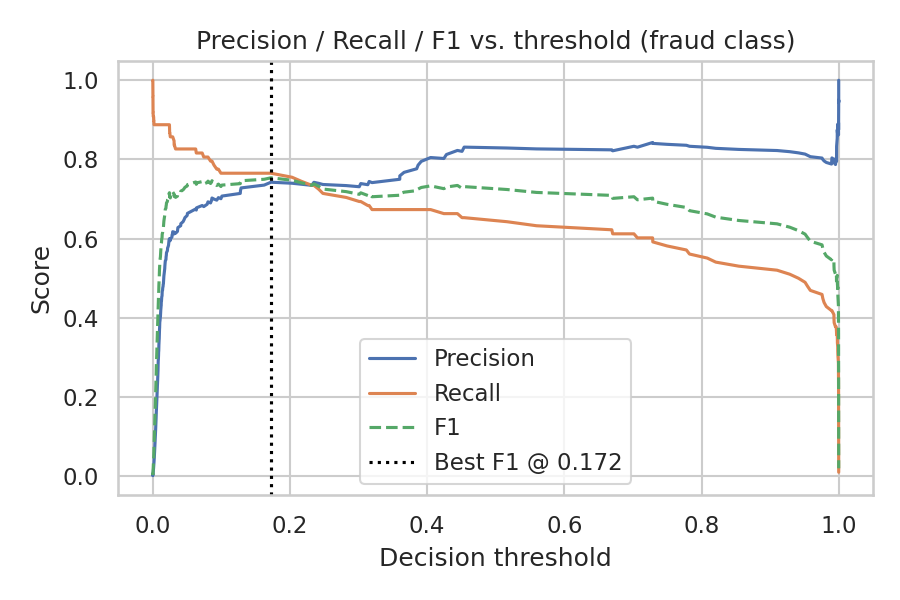

# Credit Card Fraud Detection with Logistic Regression

A complete, reproducible ML project that detects fraudulent credit card
transactions using **Logistic Regression**, trained and evaluated on the
real-world [ULB Credit Card Fraud dataset](https://www.kaggle.com/mlg-ulb/creditcardfraud)
(284,807 European cardholder transactions from September 2013, 492 of them
fraudulent).

## Results

| Model | ROC-AUC | PR-AUC | Precision (fraud) | Recall (fraud) | F1 (fraud) | Accuracy |
|---|---|---|---|---|---|---|
| Baseline (threshold 0.5) | 0.957 | 0.744 | 0.83 | 0.64 | 0.72 | 99.92% |
| Class-weighted (threshold 0.5) | 0.972 | 0.719 | 0.06 | 0.92 | 0.11 | 97.5% |
| SMOTE-resampled (threshold 0.5) | 0.970 | 0.725 | 0.06 | 0.92 | 0.11 | 97.4% |
| **Baseline, tuned threshold (0.172)** | 0.957 | 0.744 | **0.74** | **0.77** | **0.75** | **99.91%** |

**Takeaway:** raw accuracy is meaningless here — a model that always predicts
"not fraud" already scores 99.8%. The class-weighted and SMOTE models catch
more fraud (92% recall) but flood analysts with false alarms (94% of their
fraud alerts are wrong). Tuning the decision threshold on the plain baseline
model gives the best balance: **77% of fraud caught, with 74% of flagged
transactions actually being fraud** — a far more usable model in practice.

All numbers above are from an actual run on the full dataset — see
[`outputs/metrics.json`](outputs/metrics.json) for the raw output.

### Plots

| | |
|---|---|
|  |  |
|  |  |

## Project structure

```
.
├── data/                       # dataset lives here (not committed, see below)
├── scripts/
│   └── download_data.py        # fetches & unzips the dataset
├── src/
│   ├── train.py                # full pipeline: EDA, training, evaluation, plots
│   └── predict.py               # load the saved model and score new transactions
├── models/                      # saved model + scaler (generated by train.py)
├── outputs/                     # metrics.json + all plots (generated by train.py)
├── requirements.txt
└── README.md
```

## How it works

1. **Preprocessing** — `Time` and `Amount` are standard-scaled (the other 28
   features, `V1`–`V28`, are already PCA-transformed and pre-scaled by the
   dataset creators for anonymity).
2. **Three logistic regression variants** are trained and compared:
   - a plain baseline
   - one with `class_weight='balanced'` to upweight the rare fraud class
   - one trained on a SMOTE-oversampled training set
3. **Model selection** — the model with the best PR-AUC (the right metric
   for a ~0.17%-positive dataset) is chosen.
4. **Threshold tuning** — instead of the default 0.5 cutoff, the decision
   threshold is swept over the precision-recall curve to find the one that
   maximizes F1 on the fraud class.
5. **Artifacts** — the trained model, the fitted scaler, all metrics, and
   diagnostic plots (class balance, amount distribution, ROC curves,
   confusion matrix, feature importance, threshold tuning) are saved to
   `models/` and `outputs/`.

## Setup & reproduce

```bash
git clone <this-repo-url>
cd credit-card-fraud-detection
pip install -r requirements.txt

# Download the dataset (~150MB, not committed to the repo)
python scripts/download_data.py

# Train, evaluate, and generate all plots
python src/train.py

# Score a few sample transactions with the saved model
python src/predict.py
```

## Why logistic regression here

Logistic regression is a strong first choice for fraud detection because:
- It outputs a **probability**, not just a label — so the alert threshold
  can be tuned to the business's tolerance for false positives vs. missed fraud.
- Its coefficients are **interpretable** — you can see exactly which
  features push a transaction toward "fraud," which matters for compliance
  and analyst trust (see `outputs/feature_importance.png`).
- It's fast to train and serve, which matters for near-real-time transaction
  scoring.

In production, this baseline would typically be compared against gradient
boosting (XGBoost/LightGBM) or anomaly-detection models (Isolation Forest,
autoencoders) to catch fraud patterns that aren't linearly separable — but
logistic regression remains a solid, explainable baseline and is often kept
in the loop as a fast first-pass filter or for regulatory explainability.

## Dataset

Source: [Machine Learning Group – ULB, via Kaggle](https://www.kaggle.com/mlg-ulb/creditcardfraud).
Transactions made by European cardholders in September 2013 over two days.
Features `V1`–`V28` are PCA components (original features withheld for
confidentiality); `Time` is seconds since the first transaction; `Amount` is
the transaction amount; `Class` is 1 for fraud, 0 otherwise.

## License

MIT
